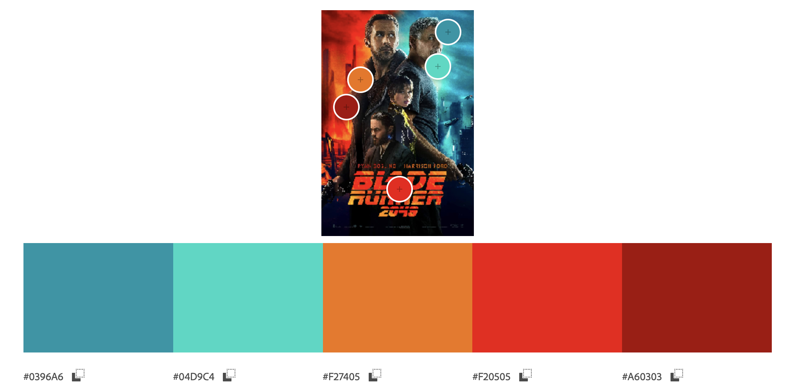
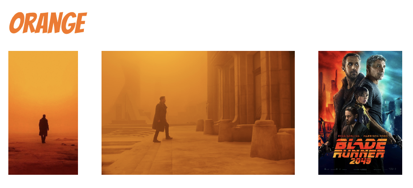
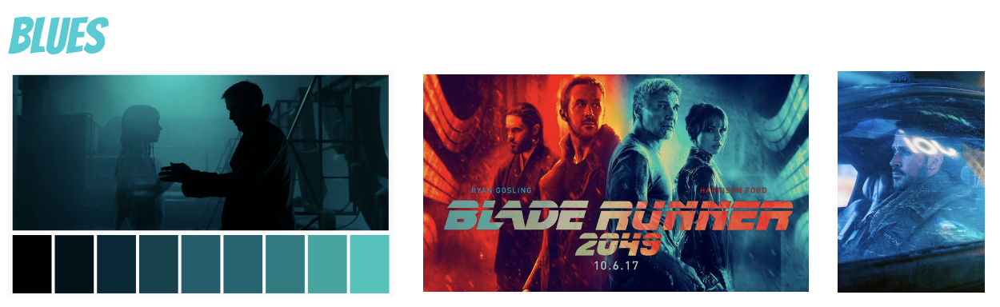
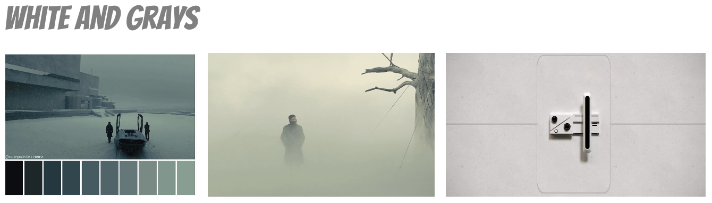
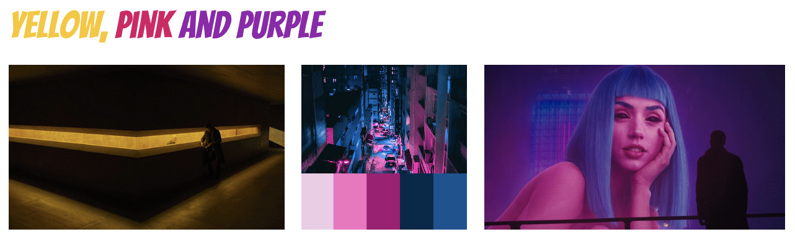

## Web Typography, 2020/2021

Als je doof bent, of als je om een andere reden geen geluid kunt horen, dan mis je veel informatie als je een film kijkt. Knisperende voetstappen, langzaam aanzwellende muziek, nerveus getik op een deur, je hoort het natuurlijk allemaal niet. Nu bestaat er zoiets als *closed caption*, wat een type ondertiteling is waarbij ook dingen als omgevingsgeluiden en de muziek beschreven worden. Hierdoor krijgt een kijker die informatie wel binnen.

Alleen wordt die auditieve informatie nogal neutraal beschreven. Het geluid van huilend persoon zou bijvoorbeeld beschreven kunnen worden als *snikgeluid op de achtergrond*. En iemand die lacht zou geschreven kunnen worden als *iemand lacht.* Heel neutraal, bijna zakelijk, en bovendien allebei in precies hetzelfde neutrale lettertype. Terwijl het toch echt over twee heel verschillende emoties gaat. 

Dat kan visueel sterker.

En dat gaan jullie doen.

## Leerdoelen

- Je kan de kennis over vormgeving die je hebt opgedaan tijdens de minor technisch toepassen met behulp van CSS
- Je kan verborgen nuance uit een audiotrack overtuigend vertalen naar visuele (typografische) beelden
- Je kan je typografische keuzes onderbouwen.
- Je hebt de exclusive design principles gebruikt.

## Oplevering

Je levert een werkende versie op, gemaakt met HTML, CSS en JavaScript. Deze staat op Github. In een duidelijke readme documenteer en onderbouw je je ontwerpkeuzes. Je developmentgeschiedenis is terug te vinden op GitHub.

Je levert ook een *screen recording* met audio op van je fragment. Dit is een video van de definitieve versie, gemaakt van jouw browserscherm.

De beoordeling is mondeling en volgt [de rubric uit het beoordelingsformulier](web-typografie-beoordeling.pdf).

## Typografische restricties

Je *moet* een van deze twee opties kiezen, en je keuze moet je onderbouwen. In je readme staat een uitleg over je overwegingen om de ene of de andere restrictie te kiezen.

### Optie 1: Systeemfont

De eerste optie is dat je gebruik maakt van het zogenaamde *systeemfont* van degene die naar jouw werk kijkt. Dit font verschilt per operating system, en het verschilt soms zelfs per versie van het operating system. Het is ook aan te passen door de gebruiker zelf. 

Je hebt dus geen controle over welk lettertype er precies gebruikt wordt. Het levert dus een onzeker, en beperkt typografisch palet op. Je hebt geen *light* versies, of *extrabold*. En ook geen serif en sans-serif versie van dezelfde familie. In dit geval heb je alleen de beschikking over normal, **bold** en _italic_. Dit heeft natuurlijk ook zijn voordelen!

### Optie 2: Brenner

Je kan er ook voor kiezen om gebruik te maken van de complete Brenner familie. Dit is een zeer uitgebreid en uiterst flexibel font. [Hier kan je je verdiepen in dit font](https://www.typotheque.com/blog/brenner_an_unusual_typeface_family_with_distinct_voices). Als je kiest voor dit font dan heb je de beschikking over een *sans serif*, een *condensed*, een *serif*, een *monotype*, een *slab*, een *display* en een *script* versie. En veel van deze versies hebben varianten van *light* tot *bold*, en allemaal zowel *bold* als *italic*.

Met Brenner zijn er natuurlijk veel en veel meer mogelijkheden dan met systeemfonts. Dat kan zowel een voordeel als een nadeel zijn. 

Voor een overzicht, zie [de brenner.pdf](brenner.pdf).

## Het fragment

Ik heb een fragment voorbereid. Het gaat om twee scenes uit *Blade Runner 2049*. De captions staan in de HTML, en ze verschijnen in sync met de video. [Kijk maar](closed-captions/index.html).

### De captions

De captions staan in de html, in het bestand index.html. Je kan aan elke paragraaf eventueel een of meer classes toevoegen. Bijvoorbeeld `voice1` of `voice2 soft`. Classes voeg je handmatig toe in de html.

Met JavaScript worden er een paar dingen extra gedaan: 

- er wordt aan elke paragraaf een unieke class toegevoegd (`p0`, `p1`, etc)
- Elk woord wordt in een aparte `span` gezet. Hierdoor kan je elk woord apart stylen, en eventueel ook [na elkaar laten verschijnen](https://github.com/cmda-minor-vid/web-typography-18-19/blob/master/closed-captions/css.css#L41).

### Tijdens het afspelen

Tijdens het afspeelen wordt er een class `on` op de caption gezet als hij moet verschijnen, en een class `off` als hij klaar is. *Zowel class `on` als class `off` blijft op de caption staan!*

De timimg van de captions kan je aanpassen in [closed-captions/captions.js](closed-captions/captions.js).

Er verschijnen ook classes op de body op momenten dat er geluiden worden afgespeeld, zoals `sound1` en `sound2`. Je kan geluiden toevoegen in [closed-captions/sounds.js](closed-captions/sounds.js).

*let op,* de geluiden zijn niet compleet, dit zal je zelf moeten aanvullen.

Je kan dan de nodige HTML en JavaScript genereren door gebruik te maken van [caption generator](https://cmda-minor-vid.github.io/web-typography-18-19/generator/) (in Google Chrome). 

# Design rationale

## Contents 📑

- _About this project_ What is it all about?
- _Analysing the movie_ Colors, themes and feelings
- _Translating sound_ How to make sounds visual
- _Tygography_ Choices and more
- _Bringing it all together_ Exclusive design principles and the end result
- _Author_ This project is made by...
- _Sources_ APA list with used sources

## About this project

The experience of watching a movie when you're deaf is very different from when you're not. This is not only due to the absence of sound, but also the feelings these sounds bring with them. Subtitles are often bland and do not match with the feeling of the scene at all. Change this, and deaf people will have a far better experience when they watch movies.

With this project I am going to change the experiences of deaf people by making different sounds and subtitles more visual and add feeling to them. I'll use a fragment from the movie Blade Runner for this project.
I will change the experience for deaf people by animating subtitles and the background, by using different colors to express feelings and by using the right typography. To get all of these things right, I will analyze the movie first and do some extra research. 
All of these animations and changes will be programmed by using HTML, CSS and JavaScript.

## Analysing the movie

### Color

The use of colors in this movie really distinguishes itself from other movies. The colors are often used to express feeling, to set the tone of a scene and to display a character. Instead of displaying the time of day or a space. The director uses discordant colors to create tension and unease and uses associative colors to display a character's emotions, for example blue when someone is sad (Dry, 2018). I'll  explain these hidden meanings of the colors to you below.

But first, to get a better view of things after watching the movie, I decided to throw all the elements together on a Pinterest board. This made it easier for me to extract the colors from the aesthetic of the movie.

To make sure these were the right colors, I also used the movie poster to extract colors from. These colors turned out to be about the same.

The color orange in Blade Runner is used to create a feeling of mystery, warning and action. Orange is a color that is overall known to be associated with these feelings. But orange is also the color that stands for transformation, which is what this scene is all about, the transition between act two and three. This color is only used in scenes where agent K is in Las Vegas. This immediately sets the tone for this city and, besides that, gives it a surrealistic effect (Santini, 2019).

Besides being one of the colors that stands for technology (Santini, 2019), this color also serves another purpose in this movie. It displays the mental state of characters. The color blue is added to scenes where agent K is feeling down or sad. This is used in multiple different scenes throughout the movie.

One of the other main colors of this movie is white. It is used to represent solitude and truth. But in different scenes it is also used to give an idea that some places are out of space and time, making agent K seem like a stranger to these places (Baker, 2021). Gray is also often used to create this feeling, but this color is more used to display the lifelessness of the environment (Santini, 2019).

Besides these main colors, there are also colors used for displaying different feelings. Yellow is meant to display information and is also the color that is used to display the company that creates the 'replicants'. The colors pink and purple are used to display innocence and romance, in the movie it is used to display agent K's romantic interests (Baker, 2021).

### Elements

Misty City, Neon signs, Minimalism

### Look and feel

### Mindmap

### Coclusions

## Translating sound

In this movie, there are various types of sounds used, from alarms to background music. Each of these sounds is there to create a certain effect or to evoke an emotion. I listened to all of these sounds carefully so I can translate them into visual shapes and lights. My color research helped me a lot with making certain design choices. I'll explain each of these choices below.

### Alarm

The alarm in the movie is a clear but not too loud sound, that's why I chose not to make the animation enormous or too popping. With this in the back of my mind, I created an orange box shadow around the video with a glow effect. I made the glow effect because this is a frequently used element in the movie and I picked the color orange because it stands for warning and mystery, that's the function of this small alarm, mystery because we don't know what the alarm is for yet.

### Sirens

The sound of the police sirens is there in the movie to indicate that officer K is now at the LAPD station. It's the sound of a classic police siren, so that's why I chose to make the colors red and blue flash on the left and right of the video. I gave these colors a slight glow effect to blend in with the aesthetics of the movie.

### Alarm scan

The alarm scan is a unique sound that repeats itself multiple times during this scene. It starts with a low noise that ends with a sudden high pitch. It sounds like a scan that has completed. Because of this, I made a scanning animation on the whole background in orange and black, that moves from right to left and ends with a screen filling orange. I chose the color orange because it creates the feeling of warning and made the color screen filling at the end to represent the high pitch ending of the sound.

### Peep tone

The peep tone is a very loud annoying noise in the movie, it just keeps getting higher, and then it suddenly stops. To represent this loud noise, I made a flashing box shadow, in white, that keeps getting faster and bigger until it suddenly stops. I also made the video itself move, slow at first, but then it kept moving faster until the whole screen vibrated. I chose the color white because it represents the high pitch noise and because of the contrast with the black background, this created a more intense effect. But also because it represents solitude with matches this hollow peep. I made both of these effects build up with the sound until it was so annoying to look at as the peep itself.

### Tense music

With the tense music, I decided to go for a little more subtle animation because it's the background music. This music builds up in tension and volume until the end of it. I created a little faded square on the background that moves from the top left to the bottom right, changing colors during this. It is a slightly luminous animation to match it with the movie's aesthetics. I chose the colors blue to set an anxious, tense mood of the noise it's a scene where agent K isn't doing so well and the music also represents this. I made the animation go from top right to bottom left to create that sound, it sounded like it was going from left to right.  I made the animation go faster in the end to build up the tension, just like the sound.

## Tygography

### Officer K

### Baseline test voice

### Baseline test man voice

## Bringing it all together

- Study Situation
- Ignore Conventions
- Prioritise Identity
- Add Nonsense

## Author

This project is made by Eva Zaadnoordijk for the course Web typography in October 2022, for the minor Visual Interface Design. Student number: 500847567 and teacher Vasilis van Gemert.

## Sources

Dry, J. (2018, 31 januari). Denis Villeneuve’s Brilliant Use of Color Theory Explained in One Illuminating Video — Watch. IndieWire. Geraadpleegd op 13 oktober 2022, van https://www.indiewire.com/2018/01/denis-villeneuve-color-theory-video-1201923620/ 

Baker, L. (2021, 17 september). How Blade Runner 2049 Perfected the Art of Color Theory. The Beat: A Blog by PremiumBeat. Geraadpleegd op 14 oktober 2022, van https://www.premiumbeat.com/blog/symmetry-color-cinematography-blade-runner/ 

Santini, F. (2019, 3 juni). Blade Runner 2049 cinematography. Santini Photography. Geraadpleegd op 14 oktober 2022, van https://www.santiniphotography.com/blog/blade-runner-2049-cinematography/