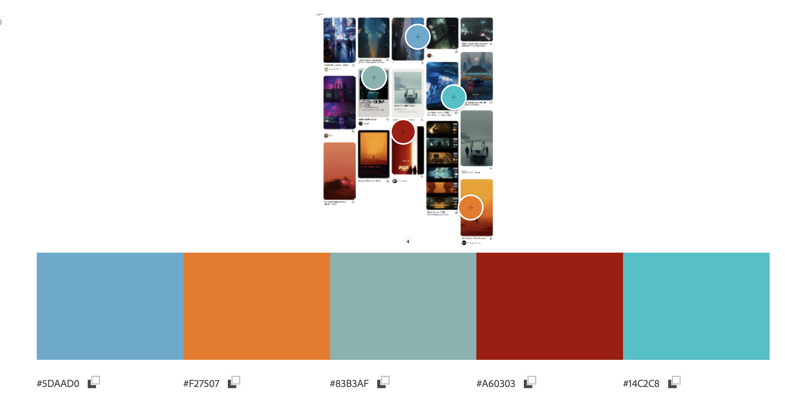

# Design rationale

## Contents 📑

- _About this project_ What is it all about?
- _Analysing the movie_ Colors, themes and feelings
- _Translating sound_ How to make sounds visual
- _Tygography_ Choices and more
- _Bringing it all together_ Exclusive design principles and the end result
- _Progress_ Feedback and insights
- _Author_ This project is made by...
- _Sources_ APA list with used sources

## About this project

The experience of watching a movie when you're deaf is very different from when you're not. This is not only due to the absence of sound, but also the feelings these sounds bring with them. Subtitles are often bland and do not match with the feeling of the scene at all. Change this, and deaf people will have a far better experience when they watch movies.

With this project I am going to change the experiences of deaf people by making different sounds and subtitles more visual and add feeling to them. I'll use a fragment from the movie Blade Runner for this project.
I will change the experience for deaf people by animating subtitles and the background, by using different colors to express feelings and by using the right typography. To get all of these things right, I will analyze the movie first and do some extra research. 
All of these animations and changes will be programmed by using HTML, CSS and JavaScript.

## Analysing the movie

### Color

The use of colors in this movie really distinguishes itself from other movies. The colors are often used to express feeling, to set the tone of a scene and to display a character. Instead of displaying the time of day or a space. The director uses discordant colors to create tension and unease and uses associative colors to display a character's emotions, for example blue when someone is sad (Dry, 2018). I'll  explain these hidden meanings of the colors to you below.

But first, to get a better view of things after watching the movie, I decided to throw all the elements together on a Pinterest board. This made it easier for me to extract the colors from the aesthetic of the movie.

To make sure these were the right colors, I also used the movie poster to extract colors from. These colors turned out to be about the same.

The color orange in Blade Runner is used to create a feeling of mystery, warning and action. Orange is a color that is overall known to be associated with these feelings. But orange is also the color that stands for transformation, which is what this scene is all about, the transition between act two and three. This color is only used in scenes where agent K is in Las Vegas. This immediately sets the tone for this city and, besides that, gives it a surrealistic effect (Santini, 2019).

Besides being one of the colors that stands for technology (Santini, 2019), this color also serves another purpose in this movie. It displays the mental state of characters. The color blue is added to scenes where agent K is feeling down or sad. This is used in multiple different scenes throughout the movie.

One of the other main colors of this movie is white. It is used to represent solitude and truth. But in different scenes it is also used to give an idea that some places are out of space and time, making agent K seem like a stranger to these places (Baker, 2021). Gray is also often used to create this feeling, but this color is more used to display the lifelessness of the environment (Santini, 2019).

Besides these main colors, there are also colors used for displaying different feelings. Yellow is meant to display information and is also the color that is used to display the company that creates the 'replicants'. The colors pink and purple are used to display innocence and romance, in the movie it is used to display agent K's romantic interests (Baker, 2021).

### Elements

Misty City, Neon signs, Minimalism

## Translating sound

In this movie, there are various types of sounds used, from alarms to background music. Each of these sounds is there to create a certain effect or to evoke an emotion. I listened to all of these sounds carefully so I can translate them into visual shapes and lights. My color research helped me a lot with making certain design choices. I'll explain each of these choices below.

### Alarm

The alarm in the movie is a clear but not too loud sound, that's why I chose not to make the animation enormous or too popping. With this in the back of my mind, I created an orange box shadow around the video with a glow effect. I made the glow effect because this is a frequently used element in the movie and I picked the color orange because it stands for warning and mystery, that's the function of this small alarm, mystery because we don't know what the alarm is for yet.

### Sirens

The sound of the police sirens is there in the movie to indicate that officer K is now at the LAPD station. It's the sound of a classic police siren, so that's why I chose to make the colors red and blue flash on the left and right of the video. I gave these colors a slight glow effect to blend in with the aesthetics of the movie.

### Alarm scan

The alarm scan is a unique sound that repeats itself multiple times during this scene. It starts with a low noise that ends with a sudden high pitch. It sounds like a scan that has completed. Because of this, I made a scanning animation on the whole background in orange and black, that moves from right to left and ends with a screen filling orange. I chose the color orange because it creates the feeling of warning and made the color screen filling at the end to represent the high pitch ending of the sound.

### Peep tone

The peep tone is a very loud annoying noise in the movie, it just keeps getting higher, and then it suddenly stops. To represent this loud noise, I made a flashing box shadow, in white, that keeps getting faster and bigger until it suddenly stops. I also made the video itself move, slow at first, but then it kept moving faster until the whole screen vibrated. I chose the color white because it represents the high pitch noise and because of the contrast with the black background, this created a more intense effect. But also because it represents solitude with matches this hollow peep. I made both of these effects build up with the sound until it was so annoying to look at as the peep itself.

### Tense music

With the tense music, I decided to go for a little more subtle animation because it's the background music. This music builds up in tension and volume until the end of it. I created a little faded square on the background that moves from the top left to the bottom right, changing colors during this. It is a slightly luminous animation to match it with the movie's aesthetics. I chose the colors blue to set an anxious, tense mood of the noise it's a scene where agent K isn't doing so well and the music also represents this. I made the animation go from top right to bottom left to create that sound, it sounded like it was going from left to right.  I made the animation go faster in the end to build up the tension, just like the sound.

## Tygography

### Agent K

For Agentr K I chose the font Brenner sans medium. I picked this font because this is the voice of the main character, this font represents him well because it includes bold simple letters that are easy to read, this fits his calm character. I gave these letters a glow effect to match with the aesthetics of the movie and made them blue to represents agent K's mental state in this scene, which is a little down after the events that happened before this scene. In the scene that comes next, I made the letters even a darker blue because agent K feels even more down in this scene. I also checked the contrast of this color, which is fine for bold letters and to improve the readability of them even more, because of the animations, I added a black background to the text.

### Baseline test voice

For the voice of the baseline test, I chose the font Brenner Mono Regular. I picked this font because I think it suited the voice because it has a little robotic tone in it. The font itself also reminded me of a robot. Because of it has sharp edges, straight lines and endings of letters sticking out. I decided to go with the regular version of this font because it isn't the voice of a real human or character we actually get to see, which makes it minor to agent K's voice. This font also has a slight glow effect, just like agent K's font, to match the aesthetic of the movie. I made the font color white because it is an authoritative voice that is a bit empty, the color white represents this. I also improved the readability of the font by adding a black background to the text. The only thing that is different from the regular design is agent K's officer number, I made this part Italic because it sounds different from the rest of the voice.

### Angry officer

For the voice of the angry officer, I decided to use the font Brenner Sans Bold Italic.  I picked this font because it is bold italic, bold because this sentence is a call-out to agent K, and to keep consistency with the other sentences, and italic to show that this sentence is different from others. Because this is a sneer to agent K I also added underlined the text. If you listen carefully, you will notice that the sentence is a sort of whisper, That is why I added an extra blurry effect to it, to make it look like more of a whisper and make it look different from when it would be said out loud. For the color of this sentence, I picked gray because the color gray is used in this movie to display that agent K is a sort of stranger to this world, an outsider. This sneer is a mere perfect example of this.

### Baseline test man voice

For the voice of the baseline test man, I picked the same font as the regular baseline test voice, but I made it bold.  Because this voice is not similar to the regular robotic baseline test voice, but more human. I also added a glow effect to match the aesthetics of the movie, but to improve readability reduced this effect a little. I used this font for fragment one and the entire baseline test in fragment two because those voices sounded the same to me.

## Bringing it all together

The result is a video with unique animations and subtitles that are completely adapted to the movie itself.

- Study Situation
I really took a closer look a the special color theory that is used here and to what makes this movie so different from others. I Really studied the situation in the designing of the movie, so I can adapt my design to this. Furthermore, I also listened to all the sounds to carefully design them, these sounds are also very different from each other and therefore each one needs their own unique animation. This does not exclude the subtitles that also need extra attention to detail.

- Ignore Conventions
I ignored many conventions while shaping my design. The standard subtitles for deaf people are very plain and without any emotion. I changed that, I look closer at this audience and put my focus on them. By doing so, I created a unique experience that fits the unique aesthetic of this movie. I changed almost everything about the subtitles and gave each character their own unique set of pairs of these that was adapted to their character. I went beyond the standards by doing so.

- Prioritise Identity
I really put my focus on the aesthetics of this movie while designing and dove into this a little deeper by researching the colors used in the movie and how I can use them best according to the color theory. Because of this, the design really matches the movie and makes it unique. I also took the identity of each character and gave them their own suitable style of typography in the subtitles that matches their character. By doing so I prioritize identity not only by identifying the characters but also by making my fitting to the style of the movie.

- Add Nonsense
And of course, I also added some nonsense to my project. Most of the shapes of the animations weren't based off anything related to the movie except for their brightness flickering and color. The police sirens are a perfect example of nonsense, they are designed that way just because that is what police sirens look like, and they flicker red and blue just because they're supposed to do that. As you will notice in the first sentence I decided to make agent K's officer number in italic, this is also a form of adding nonsense.

## Progress

My progress during this project went well. I started slowly, but once I got the idea of what the assignment was about, I dived into it deeper. I started first by watching the movie to get a better feeling of what it was all about, looking back this was a great idea because I Really understood the scenes and the aesthetics of this video more. Furthermore, I wanted to dive a little deeper into the movie after I watched it, the cinematography and filming of the movie spoke to me. When I did some more research, I focused mainly on the colors and found out that this movie uses a practice called the color theory. After a few days, I've got my first round of feedback, which was to look at the meaning of those colors more closely, so I did. I used this color theory and my research to implement this in my project and added certain colors to certain emotions during the scene. Then I started programming, the subtitles first, which went great. But I found it hard to program the sounds, making them visual.  I listened to these sounds more carefully and thinking of the things I associated with them. This helped me a lot. Then I've got my second round of feedback, which was to be more dramatic and bolder with the design of the sounds and to focus on them instead of the typography. I made my effects around sound bigger and more dramatic, I did this by using multiple effects and adding more color.
When I look back I think I maybe should have started sooner with the programming of the sounds, so I could make more iterations on them and really lay my focus here. I also had a hard time with the cubic bazier in CSS, this thing just wouldn't work. But overall, I'm satisfied with the end product.

## Author

This project is made by Eva Zaadnoordijk for the course Web typography in October 2022, for the minor Visual Interface Design. Student number: 500847567 and teacher Vasilis van Gemert.

## Sources

Dry, J. (2018, 31 januari). Denis Villeneuve’s Brilliant Use of Color Theory Explained in One Illuminating Video — Watch. IndieWire. Geraadpleegd op 13 oktober 2022, van https://www.indiewire.com/2018/01/denis-villeneuve-color-theory-video-1201923620/ 

Baker, L. (2021, 17 september). How Blade Runner 2049 Perfected the Art of Color Theory. The Beat: A Blog by PremiumBeat. Geraadpleegd op 14 oktober 2022, van https://www.premiumbeat.com/blog/symmetry-color-cinematography-blade-runner/ 

Santini, F. (2019, 3 juni). Blade Runner 2049 cinematography. Santini Photography. Geraadpleegd op 14 oktober 2022, van https://www.santiniphotography.com/blog/blade-runner-2049-cinematography/